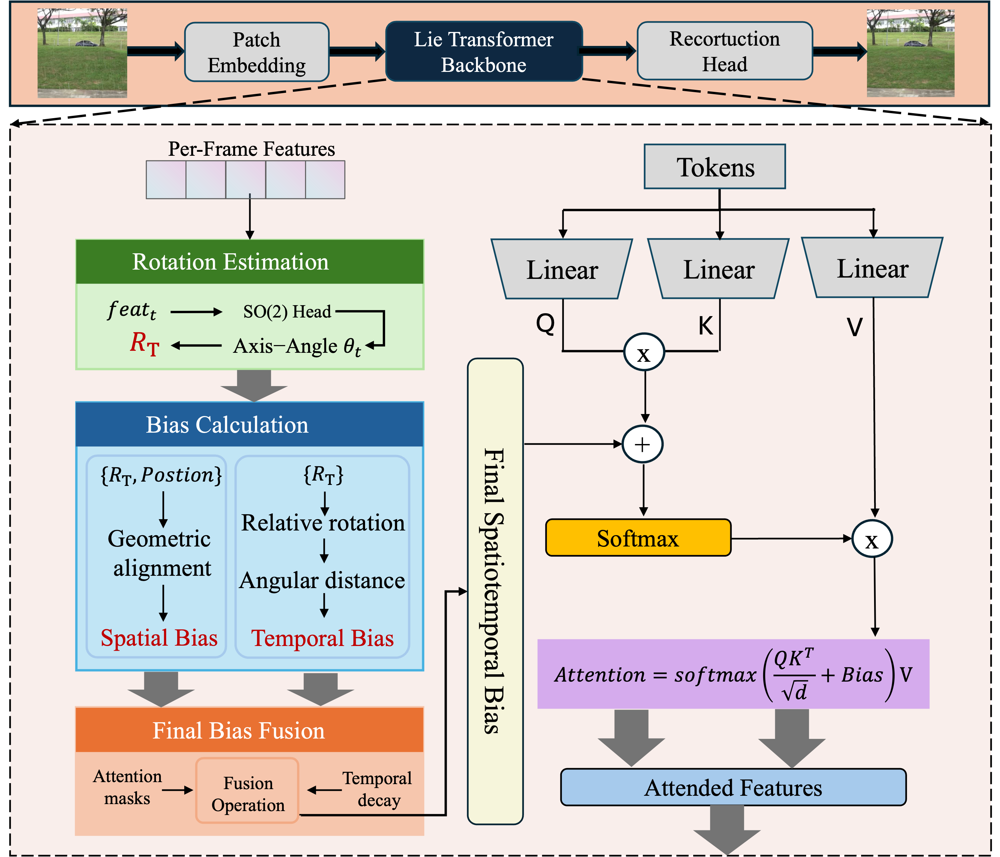
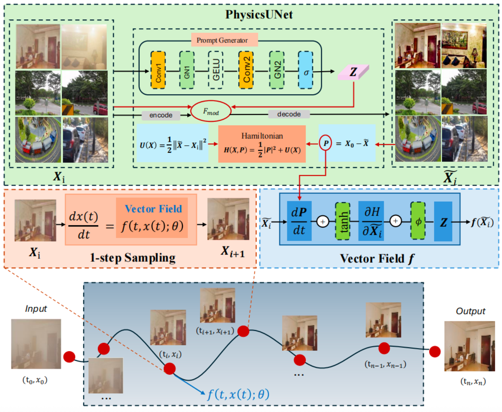

## Biography

Hello! I am a M.S. student at **Hangzhou Institute for Advanced Study, University of Chinese Academy of Sciences**. I obtained my B.E. in Mathematics and Applied Mathematics at **Shenyang University of Technology** in 2023.

My research interests lie in the intersection of **Computer Vision** and **AICG**.  
From 2023, I started to do research on image/video restoration.  
Now, I focus on designing novel applications for image/video restoration and AIGC tasks.

I am also passionate about crypto and Web3, having developed several innovative projects in this domain.

_📧 Feel free to contact me by email if you are interested in discussing or collaborating with me._

---

## 🔥 News

- [01/2026] One paper accepted by ICLR 2026 🎉 🎉 🎉 
- [10/2025] Two papers accepted by AAAI 2026 🎉 🎉 🎉 
- [10/2025] Got National Scholarship for Graduate Students 🎉 🎉 🎉 

---

## Industrial Experience

<table>
<tr>
<td style="width:100px; text-align:center; vertical-align:middle;">

</td>
<td>
<b>VIVO</b> 
Sep. 2025 - Dec. 2025 
<b>VIVO Imaging Algorithm Research Center</b>, Hangzhou, China 
<i>Topic: Light and Shadow Portrait Large Model Algorithm Research</i>
</td>
</tr>

<tr>
<td style="text-align:center; vertical-align:middle;">

</td>
<td>
<b>Hyperchain</b> 
Aug. 2023 - Sep. 2025 
<b>Hyperchain Technology Co., Ltd.</b>, Hangzhou, China 
<i>Topic: Blockchain and Quantitative Trading</i>
</td>
</tr>
</table>

---

## Education & Visiting

<table>
<tr>
<td style="width:100px; text-align:center; vertical-align:middle;">

</td>
<td>
<b>Zhejiang University, China</b> 
Visiting Student in Computer Science 
May. 2025 - Sep. 2025
</td>
</tr>

<tr>
<td style="text-align:center; vertical-align:middle;">

</td>
<td>
<b>University of Chinese Academy of Sciences, China</b> 
Master of Science in Computer Technology 
Sep. 2023 - Present
</td>
</tr>

<tr>
<td style="text-align:center; vertical-align:middle;">

</td>
<td>
<b>Shenyang University of Technology, China</b> 
Bachelor of Engineering in Mathematics and Applied Mathematics 
Sep. 2019 - Jun. 2023
</td>
</tr>
</table>

---

## Selected Publications · [<a href="https://scholar.google.com/citations?hl=zh-CN&user=rkxEcnAAAAAJ" target="_blank">Full List →</a>]

### Preprints

<table>
<tr>
<td style="width:130px; text-align:center; vertical-align:middle;">

</td>
<td>
<b>DeLiVR: Differential Spatiotemporal Lie Bias for Efficient Video Deraining</b> 
<b>Shuning Sun</b>, Jialang Lu, Xiang Chen, et al. 
<i>Submitted</i> 
<a href="https://www.arxiv.org/abs/2509.21719">Paper</a>
</td>
</tr>
</table>

### Conferences

<table>
<tr>
<td style="width:130px; text-align:center; vertical-align:middle;">

</td>
<td>
<b>UniFlowRestore: A General Video Restoration Framework via Flow Matching and Prompt Guidance</b> 
<b>Shuning Sun</b>, Yu Zhang, Chen Wu, et al. 
<i>Accepted by ACM MM 2026</i> 
<a href="https://arxiv.org/abs/2504.09069">Paper</a>
</td>
</tr>
</table>

---

<h2>Honors & Awards</h2>

  

    [10/2025]
    National Scholarship for Graduate Students.
  

  

    [04/2024]
    Web3.0 Innovation Competition — RentChain, Third Prize in Hong Kong Region.
  

  

    [08/2021]
    China Computer Games Competition — Connect Six AI, National Second Prize.
  

  

    [09/2021]
    Mathematical Contest in Modeling — Second Prize, Liaoning Province.
  

© Shuning Sun